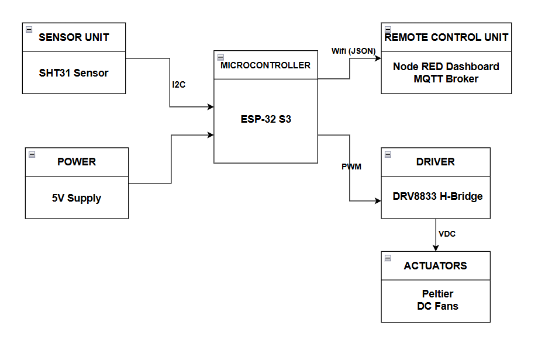

# Hệ thống Điều khiển Nhiệt độ IoT (IoT Temperature Control System)

## 📌 Giới thiệu tổng quan
Dự án **Thiết kế hệ thống giám sát và điều khiển nhiệt độ IoT"** là một giải pháp thiết bị biên (Edge Device) hoạt động theo kiến trúc Headless[cite: 11]. Hệ thống ứng dụng nhân hệ điều hành thời gian thực FreeRTOS trên vi điều khiển ESP32-S3 để xử lý thuật toán PID rời rạc[cite: 11]. Kết hợp với hạ tầng mạng riêng ảo (Mesh VPN) thông qua nền tảng Tailscale, dự án cho phép giám sát và cấu hình từ xa an toàn qua Internet mà không cần can thiệp mở cổng (Port Forwarding) trên Router vật lý[cite: 11].

## ✨ Tính năng nổi bật
- **Điều khiển thời gian thực đa lõi (Real-time Multicore Control):** Tận dụng cấu trúc 2 lõi CPU của ESP32-S3. Core 0 được ghim cố định cho tác vụ MQTT để xử lý truyền thông, trong khi Core 1 chuyên trách thuật toán PID để đảm bảo độ trễ bằng 0 cho vòng lặp điều khiển nhiệt độ[cite: 17].
- **Tối ưu hóa điều khiển (Optimized Logic):** Hệ thống kết hợp thuật toán PID rời rạc với logic if-else cơ bản để tự động điều chỉnh công suất và đảo chiều dòng điện[cite: 28]. Đồng thời, tính năng đọc độ ẩm của cảm biến SHT31 đã được chủ động loại bỏ để tập trung toàn bộ tài nguyên xử lý và tốc độ bus I2C cho tác vụ nhiệt độ[cite: 13].
- **Bảo vệ phần cứng (Hardware Protection):** Tích hợp cơ chế an toàn ngắt điện áp tải và chờ 5 giây trước khi lật trạng thái NÓNG/LẠNH để chống sốc nhiệt và vỡ cấu trúc sò Peltier[cite: 38]. 
- **Truyền thông phi tập trung (Decentralized Comms):** Giao thức MQTT được thiết lập mức chất lượng dịch vụ QoS 1, đảm bảo gói tin điều khiển (Setpoint) chắc chắn được gửi đến đích ít nhất một lần ngay cả khi mạng chập chờn[cite: 20].
- **Xuyên thấu NAT & Bảo mật (NAT Traversal):** Sử dụng Tailscale (dựa trên nền tảng giao thức mã hóa WireGuard) cài đặt trên Raspberry Pi, cung cấp IP ảo tĩnh (100.x.x.x) để quản trị an toàn từ mọi nơi[cite: 21].

## ⚙️ Cấu trúc Phần cứng

- **Vi điều khiển trung tâm (MCU):** ESP32-S3 DevKit[cite: 24]
- **Máy chủ (IoT Gateway):** Raspberry Pi 4 (Chạy Mosquitto Broker & Node-RED)[cite: 26]
- **Cảm biến (Sensor):** SHT31 (Giao tiếp I2C)[cite: 25]
- **Động cơ chấp hành (Actuator):** Sò nóng lạnh Peltier (TEC) 5V kết hợp hệ thống quạt và nhôm tản nhiệt[cite: 25]
- **IC Công suất (Driver):** Mạch cầu H L298N (Nhận tín hiệu băm xung PWM ở tần số 18kHz, độ phân giải 12-bit để điều tiết dòng cho sò Peltier)

## 🧩 Cấu trúc Phần mềm
Hệ thống được thiết kế theo mô hình phân lớp (Layered Architecture) gồm 6 tầng rõ rệt[cite: 30]:
1. **Hardware:** Lớp linh kiện vật lý (ESP32-S3, SHT31, L298N, Peltier)[cite: 30].
2. **HAL:** Lớp trừu tượng hóa phần cứng (I2C, PWM)[cite: 30].
3. **RTOS:** Nhân FreeRTOS quản lý đa nhiệm (Task_Control & MQTT_Event_Task) và định thời[cite: 30].
4. **Application:** Xử lý thuật toán điều khiển PID[cite: 30].
5. **Communication:** Ngăn xếp Wi-Fi và MQTT Client đóng gói JSON[cite: 30].
6. **Cloud / Backend:** Máy chủ Node-RED, Mosquitto Broker và Tailscale VPN[cite: 30].

## 🚀 Hướng dẫn hệ thống

### Cấu trúc Topic MQTT
- `hethong/temp_control`: ESP32 publish dữ liệu giám sát định kỳ (Nhiệt độ, Độ ẩm, Setpoint hiện tại, mức PWM, Mode) với chu kỳ 1 giây/lần[cite: 39].
- `hethong/set_from_web`: ESP32 subscribe để lắng nghe sự kiện thay đổi Setpoint từ người dùng thao tác qua Web Dashboard[cite: 39].
